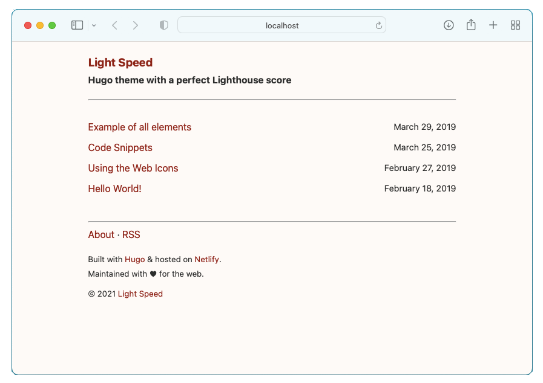

# Light Speed

An insanely fast and performance-based Hugo theme, ported from [Light Speed Jekyll](https://github.com/bradleytaunt/lightspeed).



Some fun facts about the theme:

* Perfect score on Google's Lighthouse audit
* Only ~700 bytes of CSS
* No JavaScript
* Now with SEO!

-----
## Theme Installation
1. Inside the folder of your Hugo project, run: `git submodule add https://github.com/iHarshad/lightspeed themes/lightspeed`
2. Open `config.toml`, change the theme to "lightspeed" and set tagline:

```toml
theme = "lightspeed"
[params]
  tagline = 'Hugo theme with a perfect Lighthouse score'
```

## Theme Options
Available options under `[params]` in `config.toml`.
```toml
[params]
  OptionName = OptionValue
```

| Option               | Example Values          | Description |
| -------------------- | ----------------------- | ----------- |
| `BodyBackground`     | `"#f1faee"`             | Override the background color for all pages. |
| `FontColor`          | `"#1d3557"`             | Override the font color for all pages. |
| `HrefLink`           | `"#e63946"`             | Override the font color for all links. |
| `PreBackground`      | `"#fdfdfd"`               | Override the background color for all inline code blocks. |
| `PreFontColor`       | `"#457b9d"`             | Override the font color for all inline code blocks. |
| `TableBorder`        | `"#424242"`             | Override the font color for table borders. |
| `CopyrightStartYear` | `"2020"`                |  If set, it will show **(C)&lt;Start Year&gt; - &lt;Current Year&gt;** in footer.<br>If not defined, footer defaults to show **(C) &lt;Current Year&gt;**. |
| `BuiltWith`          | `true`                  |  If defined, it shows **Built with Hugo** text in footer. |
| `HostedOn`           | `"Netlify"`             | Hosting provider name. |
| `HostedOnLink`       | `"https://netlify.com"` | Link to hosting provider website. Defaults to `#` if not set. The `HostedOn` option needs to be set for this to render. |
| `MaintainedMsg`      | `true`                  | `true` - Shows _Maintained with &hearts; for the web._ in footer.<br>`false` - Do not show anything in footer.<br>`Custom Message` - Shows custom message in footer. |

### Override Favicon
To override default favicons, place them in your Hugo projects `static` directory.
 * `./static/favicon.svg`
 * `./static/favicon.png`
 * `./static/apple-touch-icon.png`

## License
Open sourced under the [MIT license](LICENSE).
